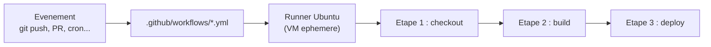
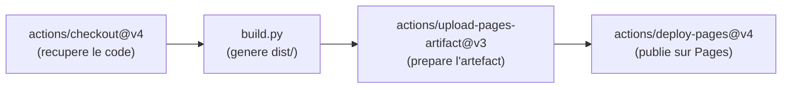
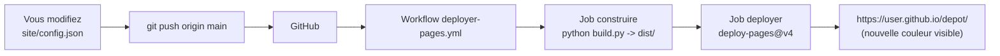

<a id="top"></a>

# Mission GitHub Actions : publier un site sur GitHub Pages, en un push

> **Projet 14 — CI/CD avec GitHub Actions** · Niveau **débutant → intermédiaire** · Durée estimée : **1 h 30 à 2 h**
>
> Vous recevez un mini-site statique **déjà relié** à deux workflows GitHub Actions fonctionnels. Vous clonez, vous poussez, votre site est en ligne. Vous changez une couleur dans `config.json`, vous re-poussez, la page publique se met à jour toute seule. Vous terminez par réparer trois workflows défectueux qui illustrent les erreurs classiques du CI/CD.

---

## Table des matières

- [Le contexte](#le-contexte)
- [Concepts essentiels avant de commencer](#concepts-essentiels-avant-de-commencer)
- [L'architecture cible](#larchitecture-cible)
- [Disposition des fichiers](#disposition-des-fichiers)
- [Les règles du jeu](#les-regles-du-jeu)
- [Préparation](#preparation)
- [Les missions](#les-missions)
- [Livrables](#livrables)
- [Questions de réflexion](#questions-de-reflexion)
- [Barème](#bareme)
- [Boîte à outils GitHub Actions](#boite-a-outils-github-actions)
- [ANNEXE A — Le site statique](#annexe-a--le-site-statique)
- [ANNEXE B — Les workflows fournis](#annexe-b--les-workflows-fournis)
- [ANNEXE C — Le script de build](#annexe-c--le-script-de-build)
- [ANNEXE D — Les trois pannes à réparer](#annexe-d--les-trois-pannes-a-reparer)

---

## Le contexte

Vous venez d'être embauché comme junior dans une agence web. Votre premier travail : un mini-site « portfolio » à héberger gratuitement. La consigne du chef :

> *« Je veux pouvoir changer la couleur du site en modifiant un seul fichier, faire un `git push`, et que ça se mette à jour tout seul. Aucun FTP, aucun serveur à administrer. »*

Le sénior de l'équipe a déjà écrit **les deux workflows GitHub Actions** et le script de build. **Votre travail** :

1. Prendre en main le projet livré (`git clone` + push + activation de Pages).
2. Personnaliser `config.json` avec vos informations et vos couleurs.
3. Prouver que le cycle `push → Pages` fonctionne en changeant la couleur au moins deux fois.
4. Réparer trois workflows défectueux qui ne partent pas de zéro mais illustrent les 3 erreurs les plus courantes du CI/CD.

Ce projet n'est **pas** un TP où vous écrivez du YAML depuis zéro. C'est un TP où vous **prenez en main** une chaîne CI/CD déjà en place, comme dans une vraie équipe : vous ne réinventez pas les workflows, vous les **comprenez, personnalisez, dépannez**.

---

## Concepts essentiels avant de commencer

> **Ce document est autosuffisant.** Aucun cours externe à ouvrir pour le terminer.

### 1. Qu'est-ce que GitHub Actions ?

**GitHub Actions est un moteur d'exécution intégré à GitHub.** À chaque événement (`push`, `pull_request`, minuterie, bouton manuel), il lance des **workflows** décrits en YAML, sur des **runners** (des VM Ubuntu / Windows / macOS gratuites pour les dépôts publics).



### 2. Anatomie d'un workflow YAML

```yaml
name: Mon premier workflow            # affiche dans l'UI

on:                                   # QUAND s'executer
  push:
    branches: [main]

jobs:                                 # QUOI faire (>= 1 job)
  construire:                         # nom libre du job
    runs-on: ubuntu-latest            # OU s'executer (image de la VM)
    steps:                            # les etapes du job
      - uses: actions/checkout@v4     # etape "action reutilisable"
      - run: echo "Bonjour"           # etape "commande shell"
```

**Deux types d'étapes :**

- **`uses:`** appelle une **action** publiée (`actions/checkout@v4`, `actions/setup-python@v5`, etc.).
- **`run:`** exécute une commande shell **sur le runner**.

### 3. Les 4 déclencheurs qu'il faut connaître

| `on:` | Déclenché quand… |
|---|---|
| `push: { branches: [main] }` | On pousse un commit sur `main` |
| `pull_request: { branches: [main] }` | Quelqu'un ouvre / met à jour une PR vers `main` |
| `schedule: [{ cron: "0 6 * * *" }]` | Tous les jours à 06:00 UTC |
| `workflow_dispatch:` | Bouton **manuel** dans l'onglet Actions |

Un même workflow peut avoir **plusieurs** déclencheurs en même temps — c'est le cas de `deployer-pages.yml` (push + manuel).

### 4. Qu'est-ce que GitHub Pages ?

**GitHub Pages est un hébergement statique** offert avec chaque dépôt public. On y publie du HTML/CSS/JS via l'une des méthodes suivantes :

- Depuis une branche `gh-pages` (ancienne méthode).
- Depuis un dossier `/docs` de `main` (autre méthode).
- **Depuis un workflow GitHub Actions** (méthode moderne, celle de ce projet).

L'URL publique est `https://<utilisateur>.github.io/<nom-du-depot>/` — accessible depuis n'importe quel navigateur.

### 5. Le trio d'actions officielles pour Pages

Pour publier depuis Actions, `deployer-pages.yml` enchaîne **trois** actions officielles :



**Contrainte capitale :** le job qui publie a besoin de **permissions particulières**, sinon on obtient `Resource not accessible by integration`. Le workflow fourni les déclare déjà :

```yaml
permissions:
  contents: read
  pages: write
  id-token: write
```

C'est aussi la panne 1 de la mission 3 — retenez-la.

### 6. Variables automatiques fournies par le runner

À chaque exécution, GitHub Actions expose des variables d'environnement utiles :

| Variable | Contenu |
|---|---|
| `GITHUB_SHA` | Le SHA du commit qui a déclenché le run |
| `GITHUB_REF_NAME` | Le nom de la branche (`main`, `feature-x`, etc.) |
| `GITHUB_RUN_NUMBER` | Un compteur qui s'incrémente à chaque run |

Dans ce projet, `outils/build.py` lit ces trois variables pour les afficher sur la page publiée. **Preuve visuelle** que le déploiement provient bien d'Actions et pas d'un `python build.py` en local.

---

## L'architecture cible



**Boucle finale attendue** — vous devez la reproduire au moins **2 fois** :

1. Ouvrir `site/config.json` dans VS Code.
2. Changer `couleur_fond` (par exemple `#0f172a` → `#7c3aed`).
3. `git add site/config.json && git commit -m "changement de fond" && git push`.
4. Aller dans l'onglet **Actions** du dépôt → voir le workflow tourner en direct (~40 s).
5. Une fois **tout vert**, ouvrir `https://<vous>.github.io/<depot>/` → **le fond est violet**.

---

## Disposition des fichiers

```
projet14-github-actions-pages-tp/
├── 00-ENONCE.md                             <- ce document
├── 02-CORRECTION.md                         <- solutions detaillees (a lire APRES essai)
├── README.md
│
├── site/                                    <- LE SITE (source)
│   ├── config.json                          <- VOUS MODIFIEZ : couleurs, titre, auteur
│   └── src/
│       ├── index.html.template              <- gabarit HTML (marqueurs {{...}})
│       └── css/
│           └── style.css.template           <- gabarit CSS (marqueurs {{...}})
│
├── outils/
│   └── build.py                             <- FOURNI — a ne pas modifier
│
├── .github/                                 <- WORKFLOWS DEJA FONCTIONNELS
│   └── workflows/
│       ├── deployer-pages.yml               <- build + publie sur Pages
│       └── verifier-config.yml              <- valide config.json sur PR
│
├── casses/                                  <- 3 workflows defectueux (Mission 3)
│   ├── casse-1-permissions-manquantes.yml
│   ├── casse-2-declencheur-errone.yml
│   └── casse-3-chemin-artefact.yml
│
└── .gitignore                               <- ignore dist/
```

**Point important :** les deux workflows sont **déjà** dans `.github/workflows/`. Vous n'avez rien à écrire pour la partie déploiement — juste à comprendre ce qui s'y passe et à personnaliser `config.json`.

---

## Les règles du jeu

1. Vous **ne modifiez pas** `outils/build.py` — il est le contrat entre `config.json` et le HTML/CSS final.
2. Vous **ne poussez pas** le dossier `dist/` : il figure dans `.gitignore` et est reconstruit à chaque run.
3. Toute donnée sensible (mots de passe, clés API) va dans **Settings → Secrets and variables → Actions**, jamais dans un fichier YAML.
4. Chaque changement de couleur doit passer par **un commit** — pas de modification manuelle sur le site publié.
5. Le dépôt doit être **public** (GitHub Pages sur des dépôts privés demande un plan payant).

---

## Préparation

### Prérequis

1. **Git** installé (`git --version`).
2. **Python 3.10+** installé (`python --version` — pour tester `build.py` en local).
3. **Un compte GitHub**.
4. Ce dossier `projet14-github-actions-pages-tp/` sur votre disque.

### Étape 0 — Créer votre dépôt GitHub

1. Sur GitHub, cliquez sur **New repository**.
2. Nom suggéré : `projet14-actions-pages`.
3. Visibilité : **Public** (obligatoire pour GitHub Pages gratuit).
4. **Sans** README ni `.gitignore` (déjà fournis).

### Étape 1 — Tester le build en local

Depuis la racine du projet :

```powershell
python .\outils\build.py
```

Vous devez voir :

```
OK  dist/index.html      genere
OK  dist/css/style.css   genere
--- Substitutions appliquees ---
  {{TITRE}} -> Mon premier site pilote par GitHub Actions
  {{COULEUR_FOND}} -> #0f172a
  ...
```

Ouvrez `dist/index.html` dans un navigateur : vous voyez le site avec le fond sombre par défaut. **Si ça marche localement, ça marchera sur Actions.**

### Étape 2 — Initialiser le dépôt local et pousser

```powershell
git init
git branch -M main
git add .
git commit -m "point de depart projet14"
git remote add origin https://github.com/<votre-utilisateur>/projet14-actions-pages.git
git push -u origin main
```

### Étape 3 — Activer GitHub Pages en mode Actions

1. Sur GitHub, ouvrez le dépôt → **Settings** → **Pages**.
2. Dans **Source**, choisissez **GitHub Actions** (et **pas** *Deploy from a branch*).
3. Enregistrez.

### Étape 4 — Observer le premier déploiement

Onglet **Actions** de votre dépôt → un run intitulé **Deployer sur GitHub Pages** apparaît. Attendez qu'il passe au vert (~40 secondes après le push).

À la fin du job `deployer`, un message annonce :

```
Your site is live at https://<vous>.github.io/projet14-actions-pages/
```

Cliquez → **vous voyez votre site publié**.

---

## Les missions

### Mission 1 — Personnaliser `config.json` *(20 points)*

Ouvrez `site/config.json` et modifiez **au moins** :

- `titre` — mettez votre nom ou celui d'un projet fictif.
- `auteur` — votre nom.
- `couleur_fond` — au format `#RRGGBB` (par exemple `#7c3aed`, `#dc2626`, `#0891b2`).

Vérifiez avec `python .\outils\build.py` que le build passe toujours. Un mauvais format (`rouge`, `#ff`, `RGB(255,0,0)`) est détecté par `build.py` et bloquera le workflow.

**Contrainte :** ne cassez pas le JSON. Une virgule en trop, une accolade manquante → workflow rouge sur GitHub.

---

### Mission 2 — Prouver la boucle push → Pages *(30 points)*

**Ceci est le cœur du projet.** Vous devez démontrer que le cycle CI/CD fonctionne, en le déclenchant **au moins deux fois** :

1. Modifiez `site/config.json` (changez `couleur_fond` par exemple pour `#dc2626` — rouge).
2. `git add site/config.json && git commit -m "fond en rouge" && git push`.
3. Attendez que le workflow **Deployer sur GitHub Pages** passe au vert dans l'onglet Actions (~40 s).
4. Ouvrez `https://<vous>.github.io/<votre-depot>/` → **le fond est rouge**.
5. **Refaites l'opération** avec une autre couleur (vert `#16a34a`, bleu `#0891b2`, violet `#7c3aed`, à votre choix).

**Preuve à fournir dans le rapport :**

- **Deux captures d'écran** de la page publique avec **deux couleurs différentes**.
- Les **deux SHA de commit** correspondants (sortie de `git log --oneline`).
- **Une capture** de l'onglet Actions montrant les deux runs verts.

**Point-clé :** sur la page publique, une tuile affiche `Commit SHA : <7 caractères>`. Ce SHA correspond au dernier commit sur `main`. C'est **la preuve visuelle** que la page provient bien d'Actions.

---

### Mission 3 — Enquête : réparer 3 workflows défectueux *(30 points)*

Le dossier `casses/` contient **trois workflows défectueux**, chacun illustrant une erreur classique. Pour chacun :

1. **Copiez** le fichier dans `.github/workflows/` (aux côtés des workflows officiels).
2. **Poussez** — observez que le workflow ne se comporte pas comme prévu (échec ou absence de déclenchement).
3. **Diagnostiquez** en lisant les logs (onglet Actions → run → étape).
4. **Réparez** dans la copie de `.github/workflows/` (**pas** dans `casses/` — l'original reste défectueux).
5. **Poussez** à nouveau — le workflow doit désormais passer au vert.

| Fichier | Symptôme attendu |
|---|---|
| `casse-1-permissions-manquantes.yml` | Le job `deployer` échoue avec `Resource not accessible by integration` |
| `casse-2-declencheur-errone.yml` | Aucun run ne se déclenche : le workflow est ignoré silencieusement |
| `casse-3-chemin-artefact.yml` | Le job `construire` échoue avec `Error: Path does not exist: ./public` |

**Astuce importante :** vous pouvez lancer chaque workflow manuellement via **Run workflow** dans l'onglet Actions, sans avoir à faire un vrai commit à chaque test. Les workflows défectueux ont tous un `workflow_dispatch:` ou vous pouvez l'ajouter temporairement.

**Preuve à fournir pour chaque panne :** capture du run rouge avant, diff du correctif, capture du run vert après.

---

### Mission 4 — Bonus *(+10 points)*

Au choix, **un seul** suffit :

- **a)** Ajoutez un **badge d'état** dans un `README.md` à la racine de votre dépôt GitHub (pas celui du TP) :
  ```markdown
  
  ```
  Il affiche `passing` (vert) ou `failing` (rouge) en direct.

- **b)** Créez une **PR de test** avec un `config.json` volontairement invalide (par exemple `"couleur_fond": "rouge"`). Le workflow `Verifier la configuration` doit **échouer** et **bloquer** le merge. Fournissez la capture du blocage.

- **c)** Créez un **troisième workflow manuel** (`workflow_dispatch:`) qui envoie une notification `curl` à un webhook (URL fournie via **Settings → Secrets**, jamais en clair dans le YAML).

---

## Livrables

Un `RAPPORT.md` à la racine de votre dépôt, contenant :

1. L'**URL publique** de votre site (`https://<vous>.github.io/<depot>/`).
2. Pour la **Mission 2** : deux captures d'écran de la page avec deux couleurs différentes + les deux SHA + capture de l'onglet Actions avec les runs verts.
3. Pour la **Mission 3** : pour chaque panne, capture du run rouge + diagnostic écrit + diff du correctif + capture du run vert.
4. Vos réponses aux **questions de réflexion**.
5. (Bonus) La preuve de la mission 4 si vous l'avez faite.

---

## Questions de réflexion

1. Un workflow qui contient `on: push` sans préciser `branches:` — quand se déclenche-t-il ? Est-ce un problème ?
2. Pourquoi `id-token: write` est-il nécessaire pour publier sur GitHub Pages ? À quoi sert le jeton **OIDC** ?
3. Que se passe-t-il si deux collègues font `git push` sur `main` **en même temps** ? Le bloc `concurrency` change quoi au comportement ?
4. Vous ajoutez un secret `API_KEY` dans **Settings → Secrets**. Le code du workflow peut le lire via `${{ secrets.API_KEY }}`. Peut-il être **imprimé dans les logs** ? Pourquoi GitHub masque-t-il certaines valeurs ?
5. Vous avez deux workflows : `deployer-pages.yml` et `verifier-config.yml`. Le second est-il inutile puisque le premier fait le même build ? Justifiez pourquoi ils sont **complémentaires**.
6. Un runner GitHub Actions est une **VM éphémère** : rien n'y persiste entre deux runs. Quelle conséquence cela a-t-il si votre `build.py` créait un fichier `historique.log` ? Où faudrait-il le sauvegarder ?

---

## Barème

| Élément | Points |
|---|---|
| Mission 1 — `config.json` personnalisé et build local OK | 20 |
| Mission 2 — Preuve du cycle push → Pages (2 couleurs + captures + SHAs) | 30 |
| Mission 3 — 3 pannes diagnostiquées et réparées | 30 |
| Qualité du rapport (structure, captures, explications) | 20 |
| **Bonus** — Mission 4 | **+10** |
| **Total** | **100 (+10)** |

**Pénalités :**

- −10 par workflow situé **hors** de `.github/workflows/` (donc ignoré par GitHub).
- −15 pour tout **secret en clair** dans un fichier YAML committé.
- −5 par dossier `dist/` committé (doit rester dans `.gitignore`).
- −10 pour toute modification de `outils/build.py`.

---

## Boîte à outils GitHub Actions

```yaml
# Squelette de reference d'un workflow
name: Description humaine
on:                                       # QUAND
  push:
    branches: [main]
  pull_request:
    branches: [main]
  workflow_dispatch:                      # bouton manuel

permissions:                              # SEULEMENT ce qui est necessaire
  contents: read
  pages: write

concurrency:                              # ne pas empiler les runs
  group: pages
  cancel-in-progress: false

jobs:
  mon-job:
    runs-on: ubuntu-latest
    steps:
      - uses: actions/checkout@v4
      - uses: actions/setup-python@v5
        with:
          python-version: "3.12"
      - name: Une commande
        run: python outils/build.py
```

**Les 5 gestes qui sauvent au diagnostic :**

1. **Onglet Actions → run rouge → step échoué** : le message d'erreur est en haut, en rouge. Le lire **littéralement** évite 90 % des erreurs.
2. **`Re-run failed jobs`** : relance uniquement les étapes en échec, plus rapide.
3. **`workflow_dispatch`** : ajoute-le à tes workflows pour pouvoir les relancer manuellement sans faire un commit vide.
4. **`echo "::debug::mon message"`** : imprime un message de debug dans les logs.
5. **Lire les logs jusqu'au bout** : parfois l'erreur significative est au milieu, pas à la fin.

---
---

# ANNEXE A — Le site statique

## Fichier : `site/config.json`

C'est le **seul fichier** que vous devez modifier en temps normal.

```json
{
  "titre": "Mon premier site pilote par GitHub Actions",
  "sous_titre": "Change une couleur, fais un push, et regarde GitHub Pages se mettre a jour tout seul.",
  "couleur_fond": "#0f172a",
  "couleur_texte": "#f1f5f9",
  "couleur_accent": "#38bdf8",
  "auteur": "Etudiant du cours 420-D30-BB",
  "version": "1.0.0"
}
```

**Contraintes du fichier :**

- Les 7 clés sont **obligatoires**.
- Les 3 couleurs (`couleur_fond`, `couleur_texte`, `couleur_accent`) doivent respecter le format `#RRGGBB` — sinon `build.py` rejette.
- JSON valide : guillemets doubles, virgule après chaque champ sauf le dernier.

## Fichier : `site/src/index.html.template`

Gabarit HTML dont chaque `{{MARQUEUR}}` est remplacé par `build.py`. La page affichera :

- Le **titre** et le **sous-titre** (depuis `config.json`).
- L'**auteur** et la **version** (depuis `config.json`).
- Le **SHA du commit**, le **numéro du run** et la **branche** (depuis les variables `GITHUB_*` du runner).
- La **date de build**.

Le fichier complet est fourni dans `site/src/index.html.template`.

## Fichier : `site/src/css/style.css.template`

Gabarit CSS qui utilise `{{COULEUR_FOND}}`, `{{COULEUR_TEXTE}}` et `{{COULEUR_ACCENT}}` dans un bloc `:root`.

Extrait :

```css
:root {
  --fond: {{COULEUR_FOND}};
  --texte: {{COULEUR_TEXTE}};
  --accent: {{COULEUR_ACCENT}};
}

body {
  background: var(--fond);
  color: var(--texte);
}
```

---
---

# ANNEXE B — Les workflows fournis

## Fichier : `.github/workflows/deployer-pages.yml`

```yaml
name: Deployer sur GitHub Pages

on:
  push:
    branches: [main]
  workflow_dispatch:

permissions:
  contents: read
  pages: write
  id-token: write

concurrency:
  group: pages
  cancel-in-progress: false

jobs:
  construire:
    name: Construire le site
    runs-on: ubuntu-latest
    steps:
      - name: Recuperer le code
        uses: actions/checkout@v4

      - name: Installer Python 3.12
        uses: actions/setup-python@v5
        with:
          python-version: "3.12"

      - name: Generer dist/ a partir de config.json
        run: python outils/build.py

      - name: Preparer le dossier a publier
        uses: actions/upload-pages-artifact@v3
        with:
          path: dist

  deployer:
    name: Publier sur GitHub Pages
    needs: construire
    runs-on: ubuntu-latest
    environment:
      name: github-pages
      url: ${{ steps.publication.outputs.page_url }}
    steps:
      - name: Publier l'artefact
        id: publication
        uses: actions/deploy-pages@v4
```

**Lecture ligne par ligne :** voir [`02-CORRECTION.md`](02-CORRECTION.md) → Mission 2.

## Fichier : `.github/workflows/verifier-config.yml`

```yaml
name: Verifier la configuration

on:
  pull_request:
    branches: [main]
  push:
    branches-ignore: [main]

jobs:
  linter:
    name: Valider config.json
    runs-on: ubuntu-latest
    steps:
      - name: Recuperer le code
        uses: actions/checkout@v4

      - name: Installer Python 3.12
        uses: actions/setup-python@v5
        with:
          python-version: "3.12"

      - name: Construire en dry-run
        run: python outils/build.py

      - name: Verifier que dist/ est bien genere
        run: |
          test -f dist/index.html
          test -f dist/css/style.css
          echo "OK - site construit sans erreur"
```

---
---

# ANNEXE C — Le script de build

`outils/build.py` fait quatre choses :

1. **Lit** `site/config.json`.
2. **Valide** que les 7 clés attendues sont présentes.
3. **Valide** que les 3 couleurs sont au format `#RRGGBB` (regex).
4. **Substitue** tous les `{{MARQUEUR}}` dans les deux gabarits et écrit le résultat dans `dist/`.

Sur GitHub Actions, les variables `GITHUB_SHA`, `GITHUB_REF_NAME`, `GITHUB_RUN_NUMBER` sont automatiquement disponibles. En local, elles n'existent pas → le script affiche `local-*` à la place. C'est comme ça qu'on distingue une page **vraiment** déployée par Actions d'une page construite en local.

---
---

# ANNEXE D — Les trois pannes à réparer

## Fichier : `casses/casse-1-permissions-manquantes.yml`

Le workflow tourne mais le job `deployer` échoue avec :

```
Error: Resource not accessible by integration
```

**Question à vous poser :** quelle **section entière** manque, tout en haut du fichier, à côté de `on:` ?

## Fichier : `casses/casse-2-declencheur-errone.yml`

Un push sur `main` **ne déclenche jamais** ce workflow. Aucun run n'apparaît. Aucune erreur.

**Question à vous poser :** lisez la clé sous `on:`. GitHub attend `push`, mais que voit-on écrit ?

## Fichier : `casses/casse-3-chemin-artefact.yml`

`build.py` réussit et affiche `OK dist/index.html genere`. Mais `upload-pages-artifact` échoue avec :

```
Error: Path does not exist: ./public
```

**Question à vous poser :** où `build.py` écrit-il le site (regardez le code Python) ? Quel `path:` faut-il donc mettre dans le workflow ?

---

<p align="center">
  <strong>Cours créé par Dr. Haythem REHOUMA — Développement et déploiement de solutions de données</strong>
</p>
